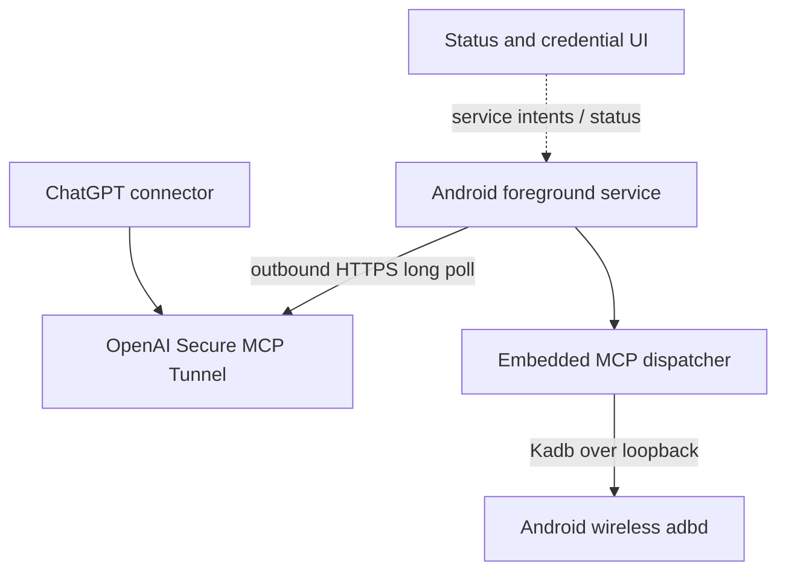
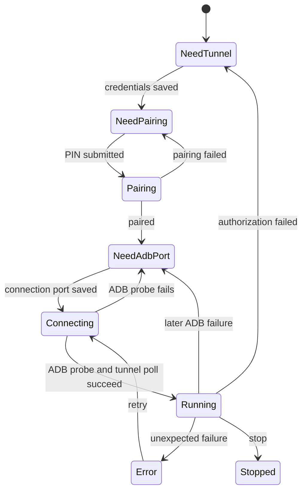

# Android ChatGPT Remote

An experimental standalone Android foreground service that exposes the same phone's paired
Wireless ADB as MCP through OpenAI's public
[Secure MCP Tunnel client protocol](https://github.com/openai/tunnel-client/blob/master/docs/protocol.md).
It requires no Termux process, DDNS record, inbound port, or public phone endpoint.

> Independent community implementation—not an official OpenAI application. It does not
> impersonate ChatGPT Remote, bypass Android's security model, or grant ADB privileges by itself.

## What it does

- Runs pairing, configuration, tunnel polling, retries, and MCP dispatch in a foreground service.
- Keeps working when the activity is closed; a persistent notification reports service status.
- Shows UI fields only when a tunnel credential, pairing PIN, or ADB connection port is needed.
- Stores the tunnel runtime key and endpoint configuration in Keystore-backed encrypted storage.
- Provides four MCP tools: `adb_status`, `adb_shell`, `adb_packages`, and `adb_properties`.
- Uses outbound HTTPS to OpenAI and loopback Wireless ADB; it opens no Internet-facing listener.

## Dashboard

Version 0.3.0 replaces the original raw parameter form with a persistent status dashboard. It shows
the verified tunnel state, local configuration summary, current action, and guided setup instructions.
The dashboard is only an Android activity: closing it does not stop the service. The persistent
notification is required by Android for a long-running foreground service and opens the dashboard
when tapped.

The status becomes **Running** only after a real local ADB shell probe succeeds and the tunnel
endpoint answers a poll successfully. A later ADB command failure immediately removes the green
state and requests an updated ADB endpoint, even if the remote tunnel itself remains connected.

The **Copy diagnostic logs** button copies a bounded support report to the Android clipboard. The
latest 500 events persist in the app's private storage across process restarts. Logs include service
lifecycle/action/state, safe exception-class chains, HTTP status classes, retry attempt and delay,
connection loss/recovery, command counts, worker failures, deadline expiry, response delivery, and
ADB tool type/outcome. They intentionally exclude credentials, tunnel/request/shard identifiers,
pairing PINs and ports, JSON-RPC bodies, shell commands, ADB output, URLs, and exception messages.

Version 0.3.2 moves synchronous tunnel HTTP polling to the I/O dispatcher. Earlier builds could
transition from **Connecting** to **Error** immediately because the foreground service launched the
poll loop from its main coroutine context.

Version 0.4.0 adds a fixed four-worker, bounded command queue; isolates per-command failures from
the poll loop; hardens malformed MCP input handling and cancellation; and uses Android's
`specialUse` foreground-service type. The previous `dataSync` type is limited to six background
hours on Android 15 and is not appropriate for a persistent, user-controlled bridge.

Version 0.4.1 reports **Running** only after the secure tunnel and a real ADB shell probe both
succeed. A later ADB tool failure immediately removes the green state, updates the notification,
and records privacy-safe health categories and failure stages in the copied diagnostics.

## Architecture



No request is routed directly from the public Internet to the phone. The service polls the tunnel,
dispatches received JSON-RPC to the embedded MCP implementation, and posts correlated responses.

## Requirements

- Samsung Galaxy or another Android 11+ device with **Wireless debugging**.
- Developer options enabled.
- Secure MCP Tunnel access, a `tunnel_id`, and a runtime key authorized for tunnel use.
- Android must allow the app's foreground service and persistent notification.

The app targets Android API 35 and supports API 26+, but same-device Wireless Debugging pairing
requires Android 11 or later in practice.

## Install and configure

1. Download `android-chatgpt-remote-debug.apk` from a successful **Android CI** run.
2. Allow installation from the browser or files application and install the APK.
3. Open the app and allow notifications when Android asks. The foreground service starts.
4. Enter the tunnel ID and runtime key if requested.
5. Put **Settings on the top half** and **ADB Remote on the bottom half** using Samsung split screen.
   In Settings, open **Developer options → Wireless debugging**.
6. Tap **Pair device with pairing code** in the top Settings window. Leave that dialog open and
   visible. In the bottom app window, enter its temporary pairing port and six-digit PIN, then tap
   **Pair device**. This confirmed layout prevents the temporary dialog from disappearing while you
   copy the PIN.
7. Return to the main Wireless debugging screen. Enter its separate **IP address & port** connection
   port in the app. Do not reuse the temporary pairing port.
8. Close the activity if desired. Confirm that the persistent notification reports the service as
   running, then configure the corresponding tunnel in ChatGPT.



Pairing success is remembered across process restarts. Android may change the Wireless ADB
connection port after Wireless debugging or the device restarts; reopen the app and update it when
the stored port no longer works.

For the complete Samsung split-screen procedure, status meanings, ChatGPT connection steps,
diagnostic interpretation, and recovery instructions, see the [User guide](docs/USER_GUIDE.md).

## MCP tools

| Tool | Input | Behavior |
| --- | --- | --- |
| `adb_status` | none | Runs `id` and reads the device model to validate ADB connectivity. |
| `adb_shell` | `command` string | Runs one command as Android's `shell` user; input is limited to 8,192 characters. |
| `adb_packages` | optional `include_system` boolean | Lists third-party packages by default, or all packages when true. |
| `adb_properties` | none | Returns Android system properties using `getprop`. |

Text output is capped at 1,000,000 characters per tool result. ADB access is powerful even without
root; require user approval for `adb_shell` calls and inspect every command.

## Tunnel protocol coverage

Implemented:

- canonical `GET /v1/tunnels/{id}/poll` and `POST /v1/tunnels/{id}/response` endpoints;
- bearer authentication and stable client name, version, instance, and MCP server-info headers;
- `200` command envelopes and normal `204 No Content` polls;
- `jsonrpc` and `session_termination` dispatch without guessing unknown command types;
- per-command correlation using request ID, channel, and shard token;
- monotonic `response_timeout` deadlines anchored at poll receipt;
- one poll loop with a bounded queue and four isolated command workers;
- bounded exponential backoff for network failures and documented terminal-response retry statuses;
- terminal handling of response `404` and operator-visible tunnel `401`/`403` failures;
- unknown JSON properties and malformed timeout values accepted for forward compatibility.

Not implemented yet:

- intermediate `jsonrpc_notify` progress delivery;
- `Retry-After` parsing;
- explicit multi-channel poll subscriptions;
- managed Cloudflare credentials, mTLS, and OAuth rewriting;
- structured tunnel-failure provenance;
- a release-signed APK or Play Store distribution.

See the [User guide](docs/USER_GUIDE.md), [Development guide](docs/DEVELOPMENT.md), and
[Security model](docs/SECURITY.md) before exposing a device.

## Build and test

The supported reproducible path is GitHub Actions. For a local build, install JDK 17, Android SDK
36, and Gradle 8.10.2, then run:

```bash
gradle --no-daemon testDebugUnitTest lintDebug assembleDebug
```

The APK is written to `app/build/outputs/apk/debug/app-debug.apk`. CI uploads both the renamed APK
and test/lint reports. Debug APK upgrades require the same signing key; uninstall an incompatible
older build first if Android reports a signature conflict.

Licensed under Apache-2.0.
