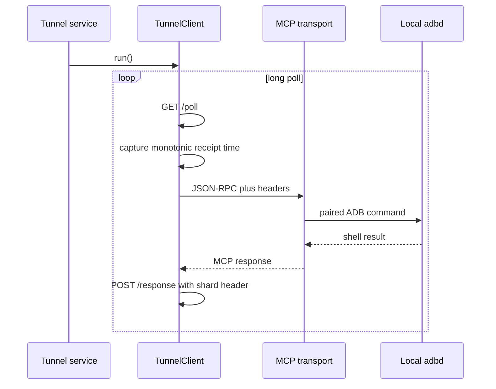

# Development guide

## Sources of truth

Protocol behavior is derived from OpenAI's public
[`docs/protocol.md`](https://github.com/openai/tunnel-client/blob/master/docs/protocol.md) and
[`docs/openapi.json`](https://github.com/openai/tunnel-client/blob/master/docs/openapi.json).
When they change, update the models, behavioral tests, coverage table in the README, and client
version together. Models deliberately ignore unknown properties.

## Components

| Component | Responsibility | Must not do |
| --- | --- | --- |
| `MainActivity` | Render status and send explicit credential/control intents. | Pair ADB, poll the tunnel, or host MCP work. |
| `TunnelService` | Own configuration state, foreground lifecycle, pairing, and client job. | Expose an exported Android endpoint. |
| `TunnelClient` | Poll, apply deadlines, bound concurrency, dispatch, correlate, and post responses. | Interpret MCP JSON-RPC semantics. |
| `AdbMcpTransport` | Implement MCP JSON-RPC and execute typed Kadb operations. | Communicate with the tunnel control plane. |
| `SecureConfig` | Persist secrets and endpoint state using encrypted preferences. | Log or broadcast stored credentials. |
| `Protocol` | Define wire models and strict timeout parsing. | Contain Android lifecycle logic. |



## Lifecycle and concurrency

`TunnelService` returns `START_STICKY`, so Android may recreate it after process removal. The service
re-evaluates encrypted configuration on a null/default start intent. It owns one `TunnelClient` job
at a time; configuration changes and Stop cancel the existing job before starting another.

`TunnelClient` uses one long-poll loop and a capacity-100 channel feeding exactly four workers.
Every command in a poll batch receives the same monotonic receipt timestamp. Time spent waiting for
a worker counts against `response_timeout`. Expired work is dropped without contacting MCP or
posting a late response, as required by the tunnel protocol. Workers isolate command failures so a
single ADB or response-delivery failure cannot cancel polling or unrelated commands.

The service is declared as `specialUse`, with a manifest subtype explaining the persistent Secure
MCP/ADB bridge. Do not change it to `dataSync`: Android 15 limits that type to six background hours.

## Error policy

- Poll network failures, `429`, and `5xx` enter bounded exponential backoff. `401` and `403` request
  operator credentials; other non-success statuses stop the client as configuration/protocol errors.
- Terminal response delivery retries transport failures plus `408`, `429`, `502`, `503`, and `504`.
- A response `404` means the command is already terminal and is not replayed.
- Cancellation is always rethrown so a configuration change or service stop cannot appear as an
  operational failure.
- Unknown command types are ignored and never reinterpreted as JSON-RPC.
- ADB exceptions return a bounded MCP tool error containing only the exception class.

## Testing

Run the same checks as CI:

```bash
gradle --no-daemon testDebugUnitTest lintDebug assembleDebug
```

Unit tests cover documented decoding, unknown properties, timeout grammar and overflow,
correlation-model defaults, actual HTTP poll paths/headers/auth failures through MockWebServer,
tunnel ID validation, malformed MCP input, notifications, and embedded MCP tool discovery. Android lint
checks manifest and application APIs. APK assembly proves the source compiles against the pinned
toolchain.

Changes to polling or response delivery should additionally add HTTP-level tests with a mock server.
Device-level Kadb pairing cannot be proven by JVM unit tests; manually validate on an Android 11+
device after dependency, target SDK, or Wireless Debugging changes.

## Release checklist

1. Compare behavior and README coverage with the current public protocol and OpenAPI schema.
2. Update application, MCP server, and tunnel client versions consistently.
3. Run unit tests, lint, and debug assembly in a clean environment.
4. Test first-time pairing, wrong PIN, changed ADB port, wrong tunnel key, retry, process recreation,
   activity closure, and explicit Stop on a physical device.
5. Configure a private release signing key before distributing beyond development testing.

## Known gaps

The exact unsupported features are maintained in the README's protocol coverage section. Do not
describe this implementation as a drop-in replacement for every mode supported by the official
client until those gaps are closed and tested.
