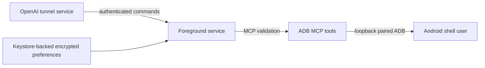

# Security model

This app creates a powerful bridge from an authenticated tunnel to Android's ADB shell user. Treat
the runtime key, paired ADB identity, device output, and every command as sensitive.

## Trust boundaries

| Boundary | Control |
| --- | --- |
| Internet → app | No inbound listener; the app initiates HTTPS to `api.openai.com`. |
| Tunnel → command | Bearer runtime key, opaque request/shard correlation, known command discriminators. |
| App → ADB | Only loopback hostnames are accepted; Android Wireless Debugging pairing is required. |
| Storage | Runtime key and endpoint data use AndroidX encrypted preferences backed by Keystore. |
| UI and IPC | Screenshots are blocked; the service is not exported; status broadcasts are package-scoped. |
| Tool output | Commands are limited to 8 KiB and returned text to 1,000,000 characters. |

## ADB risk

Commands run as Android's `shell` user, not root. That account can still inspect packages and system
state, alter many settings, launch components, capture some device data, install or remove packages
on some builds, and disrupt the device. `adb_shell` intentionally provides arbitrary shell command
execution and is the highest-risk tool.

- Configure ChatGPT tool policy to require approval for every `adb_shell` call.
- Read the full command; reject pipelines, redirections, encoded payloads, or downloads you do not
  understand.
- Do not expose the tunnel to untrusted users or autonomous workflows.
- Disable Wireless debugging and stop the service when it is not needed.

During pairing, use split screen with Settings above ADB Remote so the temporary PIN remains visible.
Treat that PIN and temporary pairing port as secrets: do not screenshot, copy into shared notes, or
include them in diagnostics or public issues. Dismiss the pairing dialog after the attempt.

## Secret handling

The app does not intentionally log runtime keys, opaque identifiers, ADB pairing data, command
bodies, exception messages, URLs, or device output. Diagnostics contain only bounded operational
metadata and safe exception class names, are capped at 500 events, and persist in private app
storage. Pairing PIN fields and runtime keys use password-style input and are cleared after
submission. Android backup is disabled. ADB failures return only an exception class, not its message.

Encrypted storage protects data at rest but does not protect a compromised, unlocked, rooted, or
debuggable device. The current artifact is debug-signed and is intended for development evaluation,
not production deployment.

## Network behavior

- Outbound tunnel traffic uses HTTPS and Android's platform trust store.
- Cleartext application traffic is disabled in the manifest.
- ADB connects only to `127.0.0.1` or `localhost` and the operator-supplied Wireless Debugging port.
- The app does not configure DDNS, port forwarding, a VPN, or an inbound HTTP/MCP server.
- A green Running state requires both a successful local ADB shell probe and an active tunnel poll.
  Runtime ADB failures revoke that state immediately; tunnel connectivity alone is never presented
  as end-to-end readiness.

The client does not currently implement certificate pinning, mTLS, managed Cloudflare mode, OAuth
rewriting, or `Retry-After`. Consult the README before assuming complete parity with the official
tunnel client.

## Incident response

If a credential or device may be compromised:

1. Stop the service and disable Wireless debugging.
2. Revoke and replace the tunnel runtime key.
3. Use Android's Wireless debugging page to forget paired workstations/devices.
4. Clear application data or uninstall the app to remove its encrypted configuration and local ADB
   pairing identity.
5. Review the tunnel account and device for unexpected activity.

Never post keys, tunnel IDs, ADB keys, pairing PINs, device logs, or MCP bodies in public issues.
