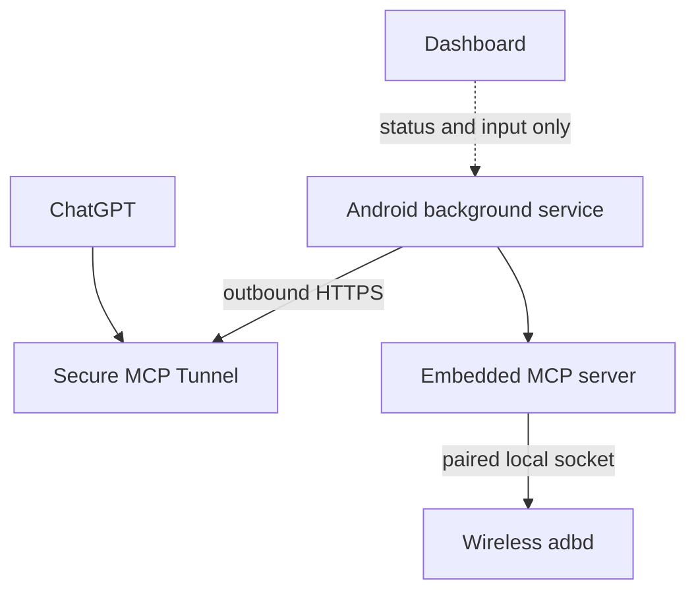
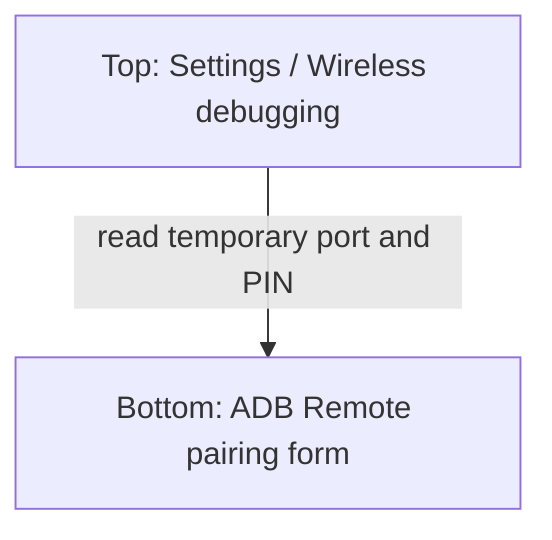

# User guide

This guide covers installation, same-phone Wireless ADB pairing, Secure MCP Tunnel setup, ChatGPT
testing, status interpretation, diagnostics, and recovery for Android ChatGPT Remote 0.4.1.

> This is an independent community application. It exposes Android's powerful ADB shell through an
> authenticated MCP tunnel. Read the [security model](SECURITY.md) and require approval for arbitrary
> `adb_shell` commands.

## How the connection works

The phone never accepts an inbound Internet connection. The background service opens an outbound
HTTPS long poll to OpenAI's Secure MCP Tunnel and translates received MCP tool calls into a paired
Wireless ADB connection on the same phone.

Closing the dashboard does not stop the service. Android displays a persistent notification because
the bridge is a foreground service. Tap the notification to reopen the dashboard.

## Requirements

- Android 11 or later for Wireless debugging; tested on Samsung Galaxy.
- Developer options and Wireless debugging enabled.
- Wi-Fi connected. Android may disable Wireless debugging when the network changes.
- A Secure MCP Tunnel ID shaped like `tunnel_` plus 32 hexadecimal characters.
- The runtime key issued with that tunnel. This is not an OpenAI API key and is not generated by the
  Android application.
- ChatGPT access that can configure the corresponding remote MCP connector.
- The debug APK from a successful repository Android CI run.

USB ADB is not supported by this same-device design. Android cannot act as a normal USB ADB host for
its own USB device endpoint. Use Wireless debugging even though both ends run on the same phone.

## Install or upgrade

1. Download `android-chatgpt-remote-debug.apk` from a successful **Android CI** run.
2. If prompted, allow the browser or file manager to install unknown applications.
3. Install the APK and open **ADB Remote**.
4. Allow notifications. Without notification permission the service can still be subject to Android
   behavior that is confusing to diagnose, and its ongoing status is not visible.
5. For an upgrade, install over the existing build to retain encrypted configuration. If Android
   reports an incompatible signature, uninstall the old build first; this clears configuration and
   requires pairing again.

Samsung may restrict long-running background work. If the service is unexpectedly stopped, set the
application battery mode to **Unrestricted** under **Settings → Apps → ADB Remote → Battery**. Exact
labels vary by One UI version.

## Configure the tunnel

1. Open ADB Remote.
2. When **Connect the secure tunnel** appears, enter the tunnel ID and runtime key.
3. Tap **Save and continue**.
4. The values are stored in Keystore-backed encrypted preferences. The key field is cleared from the
   visible form after submission.

If the dashboard reports authorization failure, obtain a currently valid runtime key for that exact
tunnel and save both values again. Do not select OAuth in ChatGPT merely because the Android form
asks for a key: authentication between this client and the tunnel control plane is bearer runtime-key
authentication. Any ChatGPT connector authentication choice must match the Secure MCP Tunnel setup.

## Pair Wireless ADB on a Samsung Galaxy

The pairing dialog is temporary and must stay open while the app submits its PIN. The confirmed,
reliable approach is Samsung split screen with **Settings above the app**.

### 1. Enable Wireless debugging

1. Enable Developer options if necessary: open **Settings → About phone → Software information** and
   tap **Build number** seven times, then authenticate.
2. Open **Settings → Developer options → Wireless debugging**.
3. Turn Wireless debugging on and approve the current Wi-Fi network if Android asks.

### 2. Arrange split screen

1. Open ADB Remote, then open the Recent apps screen.
2. Tap the **Settings** app icon above its preview and choose **Open in split screen view**.
3. Select **ADB Remote** for the second window.
4. Arrange **Settings in the top half** and **ADB Remote in the bottom half**.
5. Keep the Wireless debugging page visible in the top window.

### 3. Submit the temporary pairing values

1. In the top Settings window, tap **Pair device with pairing code**.
2. Leave the pairing dialog open. It shows a six-digit PIN and a temporary IP address and port.
3. In the bottom ADB Remote window, enter only the temporary **pairing port** and six-digit PIN.
4. Tap **Pair device** before the dialog expires.
5. Wait for the dashboard to request the ADB connection port.

Do not close the top dialog, navigate away from it, lock the phone, or reuse an expired PIN. If
pairing fails, dismiss the dialog, open a fresh one, and submit its new port and PIN.

### 4. Enter the persistent connection port

Pairing and connecting use different ports:

| Value | Where it appears | When it is used |
| --- | --- | --- |
| Pairing port | Temporary **Pair device with pairing code** dialog | Once, together with the PIN |
| Connection port | Main **Wireless debugging** page under **IP address & port** | Every ADB connection and tool call |

1. Return to the main Wireless debugging page in the top window.
2. Read the port after the colon under **IP address & port**.
3. Enter that connection port in ADB Remote and tap **Save and continue**.
4. The service performs a real `id` shell probe. Only after that probe and a successful tunnel poll
   does the dashboard become green and show **Running**.

The application currently connects to the same device through `127.0.0.1`. If a particular Samsung
firmware exposes Wireless adbd only on the displayed Wi-Fi address, the probe will fail even with the
correct port; capture diagnostics for that case.

## Understand the dashboard

| Display | Meaning | Operator action |
| --- | --- | --- |
| Setup required — tunnel | Tunnel ID or runtime key is missing or rejected. | Save valid credentials. |
| Setup required — pairing | No successful ADB pairing is recorded or pairing failed. | Use a fresh split-screen pairing dialog. |
| Pairing | The service is submitting the temporary PIN. | Keep the Settings dialog open. |
| Setup required — ADB port | The connection port is missing, the preflight probe failed, or a later ADB call failed. | Verify Wireless debugging and save the current connection port. |
| Connecting | ADB is being probed or the tunnel is connecting/reconnecting. | Wait; inspect diagnostics if it persists. |
| Running | Both local ADB and the remote tunnel were verified. | The connector is ready for testing. |
| Connection error | The background client stopped unexpectedly. | Copy logs, then tap Retry. |
| Stopped | The user stopped the service or Android destroyed it. | Reopen the app to start it again. |

**Running is composite readiness**, not merely tunnel connectivity. A failed MCP ADB operation moves
the dashboard away from Running immediately and also changes the notification.

## Connect and test from ChatGPT

Configure the Secure MCP Tunnel endpoint associated with the same tunnel ID in ChatGPT. The precise
connector screens can vary by ChatGPT plan and application version; tunnel creation and connector
availability are account-side features, not provided by this APK.

Use the connector's authentication mode prescribed by the tunnel configuration. Do not invent an
OAuth flow for the Android app: it uses the tunnel runtime key to poll OpenAI. Once connected, start
with the least invasive tool:

1. Ask ChatGPT to call `adb_status` on the Android ADB MCP connector.
2. Confirm that the response identifies Android's shell user and the phone model.
3. Test `adb_packages` if needed.
4. Use `adb_shell` only after reviewing and approving the exact command.

The available tools are:

| Tool | Purpose | Risk |
| --- | --- | --- |
| `adb_status` | Validate the connection and read the model. | Low |
| `adb_packages` | List third-party or all package names. | Moderate privacy impact |
| `adb_properties` | Read system properties. | Moderate privacy impact |
| `adb_shell` | Execute an arbitrary command as Android's shell user. | High; require approval |

## Diagnostics

Tap **Copy diagnostic logs** and paste the report into a private support conversation. The ring buffer
retains the latest 500 entries across process restarts. It excludes credentials, identifiers, ports,
commands, payloads, device output, URLs, and exception messages.

Useful 0.4.1 health events include:

| Event | Interpretation |
| --- | --- |
| `[adb] probe start` | Preflight began against the stored ADB endpoint. |
| `[adb] probe complete` | The local ADB socket and shell service worked. |
| `[adb] probe failed chain=…` | Preflight could not reach or complete ADB. |
| `[health] adb=healthy category=probe` | ADB readiness was established. |
| `[health] adb=failed category=unreachable` | Connection refused or no reachable adbd socket. |
| `[health] adb=failed category=timeout` | The socket or shell operation timed out. |
| `[health] readiness failed component=adb stage=preflight` | ADB failed before the tunnel client started. |
| `[health] readiness failed component=adb stage=runtime tunnel=connected` | A tool exposed a later ADB failure while the tunnel remained connected. |
| `[tunnel] poll connected` | The remote tunnel poll succeeded; this alone is not full readiness. |

## Troubleshooting

### ADB is unreachable or the app asks for the port again

1. Confirm Wireless debugging is still enabled.
2. Confirm the phone is still on the approved Wi-Fi network.
3. Read the current connection port from the main Wireless debugging page. Never use the pairing
   dialog's temporary port here.
4. Save the current port again. Android can rotate it after toggling Wireless debugging, rebooting,
   or changing networks.
5. If it still fails, forget the app under **Wireless debugging → Paired devices**, clear the app's
   data, and repeat split-screen pairing with a fresh PIN.
6. Copy diagnostics immediately after the failure.

### Pairing fails

- Keep Settings on top and ADB Remote below so the dialog remains visible.
- Generate a fresh PIN and temporary port for every attempt.
- Submit before the dialog expires.
- Confirm that the PIN has exactly six digits.
- Do not enter the main connection port in the pairing field.

### Tunnel connects but status is not Running

This is expected when ADB is unhealthy. Version 0.4.1 requires both layers. Look for `probe failed`,
`adb=failed`, and the health category in diagnostics, then correct the Wireless debugging port.

### Opening the dashboard causes Connecting briefly

The service may re-evaluate its stored configuration when Android starts or restores it. A short
probe/reconnect is normal. Persistent repetition should be reported with diagnostics.

### Android stops the service

- Keep the foreground-service notification enabled.
- Set battery use to Unrestricted for the application.
- Exclude it from Samsung sleeping/deep-sleeping app lists if necessary.
- Reopen the app after a reboot; automatic start at boot is not implemented.

## Stop, revoke, or reset

- Tap **Stop service** to stop polling and ADB work.
- Turn off Wireless debugging when the bridge is not needed.
- Forget paired devices in the Wireless debugging settings to revoke ADB pairing.
- Revoke the tunnel runtime key account-side if it may have leaked.
- Clear application data or uninstall to delete its encrypted local configuration.

For implementation details see the [development guide](DEVELOPMENT.md). For trust boundaries,
credential handling, and incident response see the [security model](SECURITY.md).
